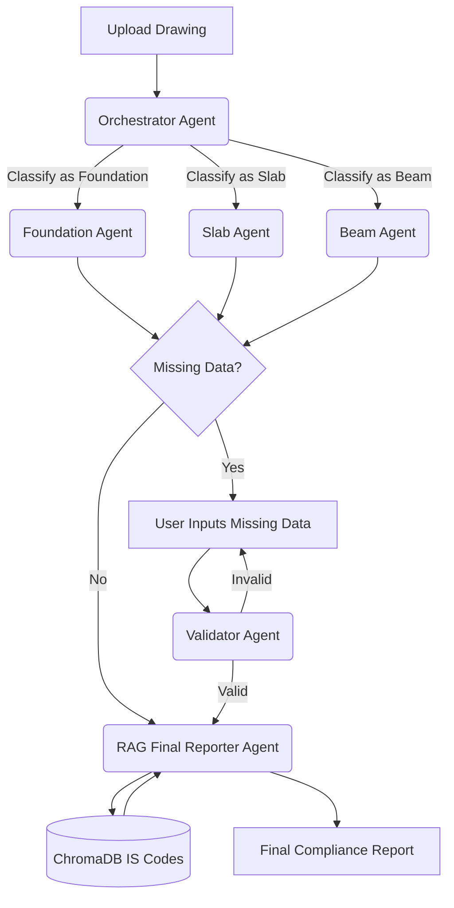

# 🏗️ Structural Compliance Check using Multi-Agent AI

> AI-powered analysis of RCC structural drawings (Foundations, Slabs, Beams) for compliance with Indian civil engineering standards.

[](https://www.python.org/downloads/)
[](https://react.dev/)
[](https://fastapi.tiangolo.com/)
[](https://opensource.org/licenses/MIT)

---

## 📋 Overview

This application uses a **Multi-Agent AI Architecture** and **RAG (Retrieval-Augmented Generation)** to analyze Reinforced Cement Concrete (RCC) structural drawings for compliance with:

- **IS 456:2000** — Indian Standard for Plain and Reinforced Concrete
- **SP 34** — Handbook on Concrete Reinforcement and Detailing

### ✨ Key Features

- 📄 **Multi-Element Support** — Analyzes Foundation, Slab, and Beam structural drawings.
- 🤖 **Multi-Agent Orchestration** — Uses a dedicated Orchestrator Agent to classify drawings, routing them to specialized agents (Foundation, Slab, or Beam specialist).
- ✅ **Validator Loop** — A validator agent automatically reviews user-supplied missing data for plausibility before generating the final report.
- 📚 **RAG-Enhanced Reports** — References actual IS code clauses for accurate compliance checking using vector embeddings.
- 💾 **Supabase Integration** — Saves user sessions, initial reports, and final reports to a PostgreSQL database with Row Level Security.
- 📊 **Professional Reports** — Viewable in the interactive dashboard and downloadable as Markdown or PDF formats.
- 🔄 **History & Resume** — View past reports, download PDFs, and seamlessly resume incomplete analyses directly from the history dashboard.

---

## 🚀 Quick Start

### Prerequisites

- Python 3.11 or higher
- [uv](https://docs.astral.sh/uv/getting-started/installation/) package manager
- Node.js (for the frontend)
- OpenRouter API key ([get one here](https://openrouter.ai/))
- Supabase project (for database and auth)

### Backend Setup (FastAPI)

```bash
# Navigate to the server directory
cd server

# Copy environment template and configure variables
cp .env.example .env

# Edit .env and add:
# OPENROUTER_API_KEY=your_key_here
# SUPABASE_URL=your_supabase_url
# SUPABASE_KEY=your_supabase_service_role_key

# Install dependencies using uv
uv sync

# Run the ingestion script to prepare the RAG vector database (ChromaDB)
uv run python ingest.py

# Start the FastAPI server
uv run uvicorn main:app --reload
```

### Frontend Setup (React + Vite)

```bash
# Navigate to the client directory
cd client

# Copy environment template
cp .env.example .env

# Edit .env and add:
# VITE_SUPABASE_URL=your_supabase_url
# VITE_SUPABASE_ANON_KEY=your_supabase_anon_key

# Install dependencies
npm install

# Start the development server
npm run dev
```

The frontend will be available at `http://localhost:5173`.

---

## 📁 Project Structure

```
├── client/                     # React Frontend
│   ├── src/
│   │   ├── api.js              # Axios setup and API client functions
│   │   ├── App.jsx             # React Router configuration
│   │   ├── components/         # Reusable UI components (Sidebar, FileUpload, etc.)
│   │   ├── context/            # React Context for Supabase Auth
│   │   └── pages/              # Route pages (Dashboard, History, Login)
│   └── package.json            # Node dependencies
│
├── server/                     # FastAPI Backend
│   ├── main.py                 # FastAPI application and route definitions
│   ├── llm_handler.py          # Specialist AI Agents for parsing images/PDFs
│   ├── llm_service.py          # Orchestrator, Validator, and Final RAG Reporter Agents
│   ├── prompt.py               # Central registry for all LLM system prompts
│   ├── vector_db.py            # ChromaDB vector store wrapper for IS Codes
│   ├── data_loader.py          # IS Code markdown chunking and indexing utility
│   ├── ingest.py               # Script to build the vector embeddings database
│   ├── auth.py                 # Supabase JWT middleware for FastAPI
│   ├── database.py             # Supabase client initialization
│   ├── SP34_md/                # Source IS code documents (markdown lists/tables/images)
│   ├── chroma_db/              # Generated Vector database
│   └── pyproject.toml          # Python dependencies (managed by uv)
```

---

## 🔧 Configuration (.env)

### Server (`server/.env`)
| Environment Variable | Description | Required |
|---------------------|-------------|----------|
| `OPENROUTER_API_KEY` | Your OpenRouter API key | ✅ Yes |
| `SUPABASE_URL` | Your Supabase project URL | ✅ Yes |
| `SUPABASE_KEY` | Your Supabase **service_role** key (bypass RLS) | ✅ Yes |

### Client (`client/.env`)
| Environment Variable | Description | Required |
|---------------------|-------------|----------|
| `VITE_SUPABASE_URL` | Your Supabase project URL | ✅ Yes |
| `VITE_SUPABASE_ANON_KEY` | Your Supabase **anon** key (safe for frontend) | ✅ Yes |
| `VITE_API_BASE_URL` | Point to backend (default: `http://localhost:8000`) | No |

---

## 📖 How It Works



### The Multi-Agent Workflow

1. **Orchestrator** — Quickly looks at the uploaded PDF/Image and classifies it as a Foundation, Slab, or Beam drawing.
2. **Specialist Extractor** — Hands the drawing off to the correct specialist prompt to perform a deep analysis (e.g., extracting steel percentage, cover depth) and identifies missing required information.
3. **Validator** — If the user provides manual overrides for missing data, the Validator agent ensures their answers are plausible engineering inputs (rejecting blank or nonsensical answers) before proceeding.
4. **RAG Reporter** — Cross-references the extracted parameters against embedded IS Code chunks from `ChromaDB` and generates a final compliance decision (Compliant / Non-Compliant / Warning).

---

## 🛠️ Tech Stack

| Component | Technology |
|-----------|------------|
| Frontend | React, Vite, Tailwind CSS, React Router |
| Backend | FastAPI, Pydantic, Python 3.11 |
| Vector DB | ChromaDB |
| Embeddings | HuggingFace `sentence-transformers/all-MiniLM-L6-v2` |
| LLMs (Vision & Text) | Google Gemini 2.5 Flash via OpenRouter |
| Database & Auth | Supabase (PostgreSQL, Row Level Security, JWT Auth) |
| PDF Processing | ReportLab (generation), PyMuPDF (parsing) |

---

## 📄 License

This project is licensed under the MIT License.
